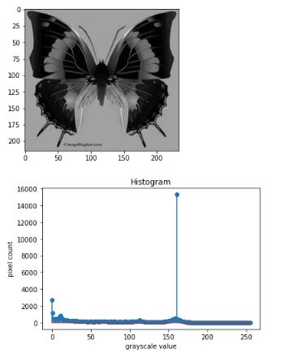
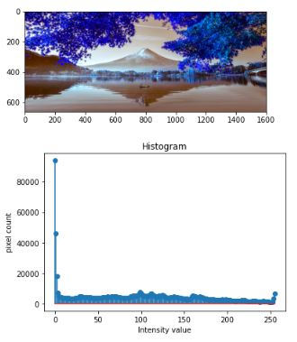

# Histogram and Histogram Equalization of an image
## Aim
To obtain a histogram for finding the frequency of pixels in an Image with pixel values ranging from 0 to 255. Also write the code using OpenCV to perform histogram equalization.

## Software Required:
Anaconda - Python 3.7

## Algorithm:
### Step1:
Import the necessary libraries and read two images, Color image and Gray Scale image.

### Step2:
Calculate the Histogram of Gray scale image and each channel of the color image.

### Step3:
Display the histograms with their respective images.

### Step4:
Equalize the grayscale image. 

### Step5:
Display the grayscale image.

## Program:
### Developed By:ragul A C
### Register Number:212221240042
```
# Write your code to find the histogram of gray scale image and color image channels.
import cv2
import matplotlib.pyplot as plt
Gray_image=cv2.imread('images.jfif')
plt.imshow(Gray_image)
plt.show()
hist=cv2.calcHist([Gray_image],[0],None,[256],[0,256])
plt.figure()
plt.title("Histogram")
plt.xlabel('grayscale value')
plt.ylabel('pixel count')
plt.stem(hist)
plt.show()


# Display the histogram of gray scale image and any one channel histogram from color image
import cv2
import matplotlib.pyplot as plt
Color_image=cv2.imread('image.jpg')
plt.imshow(Color_image)
plt.show()
hist1=cv2.calcHist([Color_image],[1],None,[256],[0,256])
plt.figure()
plt.title("Histogram")
plt.xlabel('Intensity value')
plt.ylabel('pixel count')
plt.stem(hist1)
plt.show()


# Write the code to perform histogram equalization of the image. 
import cv2
gray_image = cv2.imread("image.jpg",0)
cv2.imshow('grey scale image',gray_image)
equ = cv2.equalizeHist(gray_image)
cv2.imshow("Equalized Image",equ)
cv2.waitKey(0)
cv2.destroyAllWindows 


```
## Output:
### Input and Histogram of Grayscale Image 

<br>
<br>
<br>

### Input and Histogram of Color Image

<br>
<br>
<br>

### Histogram Equalization of Grayscale Image

<br>
<br>
<br>

## Result: 
Thus the histogram for finding the frequency of pixels in an image with pixel values ranging from 0 to 255 is obtained. Also,histogram equalization is done for the gray scale image using OpenCV.
